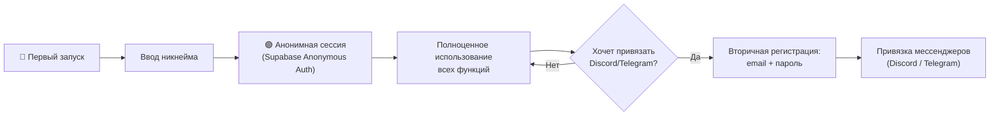
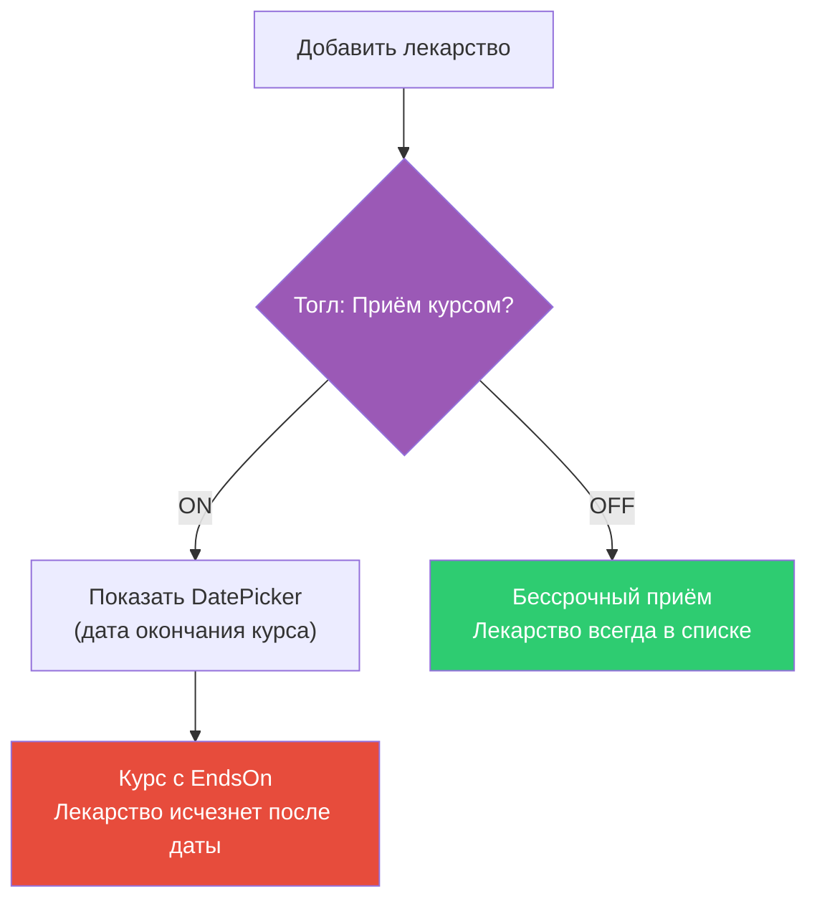

# MedTracker v2 — Переделка регистрации и логики курсов

Обновление MedTracker: двухэтапная регистрация (локальная → облачная) и упрощённая интеграция курсов в карточку лекарства.

---

## Текущее состояние (AS-IS)

### Регистрация
- **Обязательно** email + пароль + username для любого использования ([AuthViewModel.cs](file:///Users/mysechka/Desktop/MedTracker-main/src/Med.Presentation/Shell/AuthViewModel.cs))
- Без входа через Supabase Auth — все разделы кроме «Сегодня» заблокированы ([ShellViewModel.cs](file:///Users/mysechka/Desktop/MedTracker-main/src/Med.Presentation/Shell/ShellViewModel.cs#L210-L220))
- Профиль создаётся триггером `on_auth_user_created` в PostgreSQL ([init.sql](file:///Users/mysechka/Desktop/MedTracker-main/supabase/migrations/20260825120000_init.sql#L377-L399))
- Все данные привязаны к `auth.uid()` через RLS

### Курсы
- Отдельная секция навигации `Courses` с полным CRUD ([CoursesViewModel.cs](file:///Users/mysechka/Desktop/MedTracker-main/src/Med.Presentation/Courses/CoursesViewModel.cs))
- `Course` — отдельная сущность с `StartsOn`, `EndsOn`, `DurationDays`, `IsActive` ([Course.cs](file:///Users/mysechka/Desktop/MedTracker-main/src/Med.Domain/Entities/Course.cs))
- `MedicationsViewModel` уже имеет `IsChronicCourse` и `CourseDurationDays` при добавлении ([MedicationsViewModel.cs](file:///Users/mysechka/Desktop/MedTracker-main/src/Med.Presentation/Medications/MedicationsViewModel.cs#L141-L144))
- Таблица `courses` требует `ends_on IS NOT NULL OR duration_days IS NOT NULL` ([init.sql:L88](file:///Users/mysechka/Desktop/MedTracker-main/supabase/migrations/20260825120000_init.sql#L88))

---

## User Review Required

> [!IMPORTANT]
> **Локальная vs облачная модель хранения данных**
> Текущая архитектура полностью завязана на Supabase — все данные пишутся в облако через API. Для первичной "локальной" регистрации потребуется **либо локальная SQLite база + синхронизация**, **либо анонимная Supabase-сессия** (anonymous sign-in). Ниже предлагаю **анонимную сессию Supabase** как прагматичный вариант: данные физически в облаке, но пользователь не вводит email/пароль.

> [!WARNING]
> **Миграция БД**: Constraint `courses_has_end` запрещает запись курса без `ends_on` и `duration_days`. Для бессрочных лекарств (режим курса ВЫКЛЮЧЕН) нужно его ослабить — это затронет существующие данные в продакшене.

---

## Open Questions

> [!IMPORTANT]
> 1. **Локальное хранение vs Supabase Anonymous Auth**:
>    - Вариант A: **Anonymous Auth** — при первом запуске Supabase создаёт анонимную сессию, все данные сразу в облаке. При «вторичной регистрации» анонимная сессия привязывается к email/паролю через `linkIdentity`. Плюсы: не нужна локальная БД, не нужна синхронизация. Минусы: требует интернет.
>    - Вариант B: **Локальная SQLite** — полностью offline, при привязке аккаунта данные мигрируются в Supabase. Плюсы: работает без интернета. Минусы: огромный объём работы (новый слой persistance, миграция данных, конфликты).
>    - **Рекомендация: Вариант A** — минимальные изменения архитектуры.

> [!IMPORTANT]
> 2. **Что делать с существующей секцией «Курсы» в навигации?**
>    - Вариант A: Полностью удалить раздел «Курсы» из навигации, логика встраивается только в карточку лекарства.
>    - Вариант B: Оставить раздел «Курсы» для продвинутых пользователей, но основной flow через карточку лекарства.
>    - **Рекомендация: Вариант A** — проще UX, меньше путаницы.

> [!IMPORTANT]
> 3. **Telegram-бот**: В текущей кодовой базе есть Discord-бот ([discord-bot/](file:///Users/mysechka/Desktop/MedTracker-main/discord-bot)), но Telegram-бота нет. Планируется ли его создание в рамках этого обновления, или только подготовить инфраструктуру (UI привязки)?

---

## Proposed Changes

Работу предлагаю разбить на **3 фазы**, в порядке зависимости.

---

### Фаза 1: Двухэтапная регистрация

#### Концепция



---

#### [MODIFY] [IAuthService.cs](file:///Users/mysechka/Desktop/MedTracker-main/src/Med.Application/Abstractions/IAuthService.cs)
- Добавить метод `SignInAnonymouslyAsync(string username, CancellationToken)` — создание анонимной сессии
- Добавить метод `LinkEmailPasswordAsync(string email, string password, CancellationToken)` — привязка email/пароля к существующей анонимной сессии
- Добавить свойство `bool IsAnonymous { get; }` — проверка типа сессии

#### [MODIFY] [AuthSession.cs](file:///Users/mysechka/Desktop/MedTracker-main/src/Med.Application/Abstractions/AuthSession.cs)
- Добавить поле `bool IsAnonymous` для различения типов сессий

#### [MODIFY] Infrastructure: SupabaseAuthService (в `src/Med.Infrastructure/`)
- Реализовать `SignInAnonymouslyAsync` через Supabase SDK `signInAnonymously()`
- Реализовать `LinkEmailPasswordAsync` через Supabase SDK `updateUser()` с email/password
- Передавать `username` через `raw_user_meta_data`

#### [MODIFY] [AuthViewModel.cs](file:///Users/mysechka/Desktop/MedTracker-main/src/Med.Presentation/Shell/AuthViewModel.cs)
- **Полная переработка**: заменить единый экран на двухэтапный flow:
  - **Первичная регистрация**: только поле `Username` + кнопка «Начать». Email/пароль не нужны.
  - **Вторичная регистрация** (доступна из настроек/аккаунта): email + пароль + привязка мессенджеров
- Убрать обязательность email для первичного входа

#### [MODIFY] [ShellViewModel.cs](file:///Users/mysechka/Desktop/MedTracker-main/src/Med.Presentation/Shell/ShellViewModel.cs)
- Убрать блокировку навигации для анонимных пользователей (`EnsureAuthenticated` должен пропускать анонимные сессии)
- Добавить визуальный индикатор «Анонимный аккаунт» в хедере
- `PromptLoginIfNeeded()` → `PromptOnboardingIfNeeded()` (проверка первичной регистрации)

#### [MODIFY] [AccountViewModel.cs](file:///Users/mysechka/Desktop/MedTracker-main/src/Med.Presentation/Account/AccountViewModel.cs)
- Добавить режим «Привязка аккаунта» для анонимных пользователей:
  - Поля email + пароль
  - Кнопка «Привязать аккаунт»
  - После успешной привязки — раздел привязки мессенджеров (Discord / Telegram)
- Добавить `bool IsAnonymous` для отображения соответствующего UI

#### [NEW] Supabase Migration: `20261002_anon_auth.sql`
- Включить анонимную аутентификацию Supabase: `enable_anonymous_sign_ins = true`
- Обновить триггер `handle_new_user()` — корректная обработка анонимных пользователей (username из meta или `Гость_{short_id}`)
- Ослабить constraint: разрешить `profiles.username` для анонимных (не пустой, но допускать автогенерированные)

#### Avalonia UI Views (в `src/Med.Ui/`)
- Обновить `AuthView.axaml` под новый двухэтапный flow
- Обновить `AccountView.axaml` — добавить секцию привязки аккаунта

---

### Фаза 2: Упрощение логики курсов

#### Концепция



---

#### [MODIFY] [Course.cs](file:///Users/mysechka/Desktop/MedTracker-main/src/Med.Domain/Entities/Course.cs)
- Разрешить `EndsOn == null && DurationDays == null` — бессрочный курс (постоянный приём)
- `EffectiveEndsOn` уже возвращает `DateOnly.MaxValue` для такого случая — **OK, без изменений**
- Убрать валидацию «нужен EndsOn или DurationDays» из `Course.Create`

#### [NEW] Domain: `MedicationVisibilityRule` (в `src/Med.Domain/`)
- Чистый доменный метод: `bool IsVisibleOnDate(Course course, DateOnly today)` → `course.EndsOn == null || today <= course.EndsOn`
- Инкапсулирует правило: лекарство скрывается из списка после `EndsOn`

#### [MODIFY] [MedicationsViewModel.cs](file:///Users/mysechka/Desktop/MedTracker-main/src/Med.Presentation/Medications/MedicationsViewModel.cs)
- В `LoadItemsAsync`: фильтровать лекарства, у которых **все** привязанные курсы истекли
- Если у лекарства нет курсов — оно всегда видно
- Если у лекарства хотя бы один активный/бессрочный курс — видно
- Если все курсы завершились (EndsOn < today) — лекарство скрывается

#### [MODIFY] `IsChronicCourse` → `IsCourseMode` переименование  
- Текущий `IsChronicCourse` в [MedicationsViewModel](file:///Users/mysechka/Desktop/MedTracker-main/src/Med.Presentation/Medications/MedicationsViewModel.cs#L141) работает наоборот нужному: `true` = бессрочный
- Переименовать и инвертировать логику:
  - `IsCourseMode = false` (по умолчанию) → бессрочный приём, лекарство не исчезает
  - `IsCourseMode = true` → показать DatePicker для выбора даты окончания, лекарство исчезнет

#### [MODIFY] `CreateInitialCourseAndSchedulesAsync` в MedicationsViewModel
- `IsCourseMode == false` → создать курс с `EndsOn = null`, `DurationDays = null`
- `IsCourseMode == true` → создать курс с выбранной датой окончания

#### [DELETE] Раздел навигации «Курсы» (рекомендация, по решению пользователя)
- Убрать `GoCourses()` из [ShellViewModel](file:///Users/mysechka/Desktop/MedTracker-main/src/Med.Presentation/Shell/ShellViewModel.cs)
- Убрать `ShellNav.Courses` из навигации
- Удалить [CoursesViewModel.cs](file:///Users/mysechka/Desktop/MedTracker-main/src/Med.Presentation/Courses/CoursesViewModel.cs) или пометить `[Obsolete]`
- Убрать пункт «Курсы» из UI навигации (`ShellView.axaml`)

#### [NEW] Supabase Migration: `20261002_allow_permanent_courses.sql`
- Ослабить constraint: `ALTER TABLE courses DROP CONSTRAINT courses_has_end;`
- Добавить новый: `ALTER TABLE courses ADD CONSTRAINT courses_optional_end CHECK (duration_days IS NULL OR duration_days > 0);`
- Это позволит `ends_on = NULL AND duration_days = NULL` (бессрочный курс)

#### [MODIFY] Avalonia Views
- Обновить форму добавления лекарства:
  - Тогл «Приём курсом» (дефолт: OFF)
  - При ON: показать DatePicker для выбора даты окончания (вместо ввода дней)
  - При OFF: скрыть DatePicker

---

### Фаза 3: Тесты

#### Тесты регистрации

#### [NEW] `tests/Med.Presentation.Tests/Shell/AuthViewModelRegistrationTests.cs`
- Первичная регистрация: username → анонимная сессия создана
- Первичная регистрация: пустой username → ошибка валидации
- Вторичная регистрация: email + пароль привязаны к анонимной сессии
- Вторичная регистрация: невалидный email → ошибка
- Навигация: анонимный пользователь имеет доступ ко всем разделам

#### [NEW] `tests/Med.Presentation.Tests/Shell/ShellNavigationAnonymousTests.cs`
- Анонимный пользователь может перейти в «Лекарства», «Медкарта», «Настройки»
- Визуальный индикатор анонимности отображается

#### Тесты курсов

#### [NEW] `tests/Med.Domain.Tests/Entities/CourseVisibilityTests.cs`
- Бессрочный курс (`EndsOn = null, DurationDays = null`) → `EffectiveEndsOn == DateOnly.MaxValue`
- Курс с `EndsOn` в прошлом → `ContainsDate(today) == false`
- Курс с `EndsOn` в будущем → `ContainsDate(today) == true`
- Валидация: `Course.Create` допускает `null` для обоих полей (бессрочный)

#### [NEW] `tests/Med.Domain.Tests/MedicationVisibilityRuleTests.cs`
- Лекарство без курсов → всегда видно
- Лекарство с бессрочным курсом → видно
- Лекарство с истёкшим курсом → скрыто
- Лекарство с истёкшим + бессрочным курсом → видно (хотя бы один активный)

#### [NEW] `tests/Med.Presentation.Tests/Medications/MedicationsViewModelCourseToggleTests.cs`
- `IsCourseMode = false` → курс создаётся без `EndsOn`
- `IsCourseMode = true` → курс создаётся с `EndsOn`
- Переключение тогла → корректное обновление формы

#### [MODIFY] Существующие тесты
- Проверить и адаптировать тесты в `Med.Domain.Tests`, `Med.Application.Tests`, `Med.Presentation.Tests` — убедиться, что:
  - Тесты `Course.Create` не ломаются после ослабления валидации
  - Тесты `DoseEventMaterializer` корректно работают с бессрочными курсами
  - Тесты `ConfirmDoseUseCase` не зависят от `EnsureAuthenticated` блокировки

#### Тесты безопасности

#### [NEW] `tests/Med.Application.Tests/Security/AnonymousSessionSecurityTests.cs`
- Анонимная сессия имеет доступ только к своим данным (RLS не нарушен)
- `LinkEmailPasswordAsync` не позволяет захватить чужую сессию
- Anon Key не может получить service_role доступ (существующий `SupabaseOptionsValidator` продолжает работать)

#### Тесты производительности

#### [MODIFY] `tests/Med.Performance.Tests/`
- Добавить бенчмарк: фильтрация лекарств с проверкой видимости курсов (100, 500, 1000 лекарств)
- Убедиться, что фильтрация не добавляет заметной задержки

---

## Verification Plan

### Automated Tests
```bash
# Прогон всех unit-тестов
dotnet test MedTracker.slnx

# Только новые тесты
dotnet test tests/Med.Domain.Tests --filter "FullyQualifiedName~CourseVisibility|MedicationVisibility"
dotnet test tests/Med.Presentation.Tests --filter "FullyQualifiedName~AuthViewModel|ShellNavigation|CourseToggle"
dotnet test tests/Med.Application.Tests --filter "FullyQualifiedName~AnonymousSession"

# Бенчмарки
dotnet run -c Release --project tests/Med.Performance.Tests
```

### Manual Verification
1. **Первичная регистрация**: Запустить приложение → ввести никнейм → убедиться, что все разделы доступны
2. **Вторичная регистрация**: Настройки → Привязать аккаунт → email + пароль → проверить что данные сохранены
3. **Тогл курса OFF**: Добавить лекарство без курса → убедиться, что оно всегда в списке
4. **Тогл курса ON**: Добавить лекарство с датой окончания → дождаться/имитировать дату → лекарство исчезло
5. **Миграция БД**: Накатить миграцию на тестовый Supabase → убедиться что constraints корректны
6. **RLS**: Через Supabase Dashboard проверить, что анонимные пользователи видят только свои данные

---

## Порядок реализации и оценка

| Фаза | Компонент | Оценка |
|:---:|---|---|
| 1.1 | `IAuthService` + `AuthSession` расширения | ~1ч |
| 1.2 | Infrastructure: `SupabaseAuthService` анонимный вход | ~2ч |
| 1.3 | `AuthViewModel` переработка | ~3ч |
| 1.4 | `ShellViewModel` + `AccountViewModel` адаптация | ~2ч |
| 1.5 | Supabase миграция + Views | ~2ч |
| 2.1 | `Course.cs` + `MedicationVisibilityRule` + миграция БД | ~2ч |
| 2.2 | `MedicationsViewModel` фильтрация + тогл | ~3ч |
| 2.3 | Удаление/деактивация раздела «Курсы» | ~1ч |
| 2.4 | UI обновления (Avalonia Views) | ~2ч |
| 3.1 | Тесты регистрации | ~2ч |
| 3.2 | Тесты курсов | ~2ч |
| 3.3 | Тесты безопасности + производительности | ~1ч |
| | **Итого** | **~23ч** |
