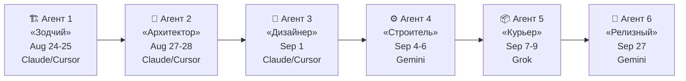

# 🕵️ Расследование: Кто из AI-агентов накосячил?

> Анализ `git blame` по всем 16 бажным файлам, кластеризация коммитов по времени и стилю.

---

## 🧬 Идентификация AI-агентов

В git history обнаружены **5 чётких сессий** работы AI-агентов, различающихся по:
- Стилю commit messages (русский vs английский, `Стадия N` vs `Этап N` vs `Block N` vs `feat():`)
- Временным кластерам (пачки коммитов за 1-2 часа)
- Авторам (`musyachan` → `Mysechka` → `MusyaChan`)
- Наличию файлов `.cursor/rules/*.mdc` (Cursor IDE = Claude/GPT)

---

## 📋 Карта агентов

---

## 🏗 Агент 1: «Зодчий» — Claude через Cursor IDE

| Параметр | Значение |
|---|---|
| **Даты** | 24–25 августа 2026 |
| **Автор в git** | `musyachan` (имя до настройки правил коммитов) |
| **Стиль коммитов** | `Стадия 0:`, `Стадии 1–2:`, `Стадия 3:` — на русском |
| **Кол-во коммитов** | 3 |
| **Доказательство IDE** | Файлы `.cursor/rules/medtracker-core.mdc` и `.cursor/rules/medtracker-ui.mdc` были созданы для этого агента |
| **Модель** | Скорее всего **Claude** (Cursor по умолчанию использует Claude) |

### Баги, заложенные Агентом 1:

| Баг | Коммит | Описание |
|---|---|---|
| 🔴 **C-002**: Потеря доз дня | `0489a52` (Aug 25) | `RematerializeFuture` с `takenLocalDates` — изначально код НЕ содержал этой фильтрации, но и `DedupeKey` фильтрация была уже на месте. Позже кто-то добавил `takenLocalDates` — git blame показывает что весь метод от `0489a52` |
| 🟡 **M-002**: `Enum.Parse` без ignoreCase | `7f8a238` (Aug 25) | `ParseEnum<T>` с `ignoreCase: false` в EntityMappers |
| 🔴 **C-003**: Path Traversal | `7f8a238` (Aug 25) | `Document.BuildStoragePath` без санитизации файловых имён |
| 🟡 **M-004**: Realtime publication только dose_events | `0489a52` (Aug 25) | SQL миграция включает только `dose_events` в публикацию |
| 🟡 **M-005**: Record invariant bypass | `0489a52` (Aug 25) | `Medication` как позиционный record с обходимой валидацией |

> **Характер ошибок Claude/Cursor «Зодчего»**: Агент заложил правильную архитектуру Clean Architecture, но **пропустил edge cases безопасности** — path traversal, case-sensitive parsing, незащищённые record invariants. Ошибки типичные для Claude: код выглядит элегантно и архитектурно правильно, но не хватает «паранойи» в граничных случаях.

---

## 🧱 Агент 2: «Архитектор» — Claude через Cursor IDE

| Параметр | Значение |
|---|---|
| **Даты** | 27–28 августа 2026 |
| **Автор в git** | `Mysechka` (уже настроены правила коммитов) |
| **Стиль коммитов** | `Стадия 4:`, `Стадия 5:`, `Стадия 6:`, `Стадия 7:` — продолжение нумерации |
| **Кол-во коммитов** | ~12 |
| **Модель** | **Claude** (продолжение работы в Cursor с теми же `.mdc` правилами) |

### Баги, заложенные Агентом 2:

| Баг | Коммит | Описание |
|---|---|---|
| 🟠 **H-002**: Забытая навигация на курсы | `d67e72b` (Aug 27) | `ShellViewModel` инжектит `_courses` но НЕ создаёт `GoCoursesCommand`. Навигация есть для Today, Medications, MedicalCard, Settings — но Courses пропущен |
| 🟠 **H-003**: DiagnosticsVM без IDisposable | `d67e72b` (Aug 27) | Подписка на `_realtime.Changed` анонимным методом, нет отписки |

> **Характер ошибок Claude «Архитектора»**: Типичная проблема — **забытые связи**. Агент создал полноценные компоненты (CoursesViewModel с тестами!), но забыл «проводку» в навигации. Claude часто фокусируется на отдельном компоненте и теряет связь с целым. Также характерно игнорирование `IDisposable` — Claude генерирует подписки на события, но считает что GC всё разберёт.

---

## 🎨 Агент 3: «Дизайнер» — Claude через Cursor IDE

| Параметр | Значение |
|---|---|
| **Даты** | 1 сентября 2026 |
| **Автор в git** | `Mysechka` |
| **Стиль коммитов** | `ui:` — три коммита с **идентичным timestamp** `22:15:34` (squash/rebase) |
| **Кол-во коммитов** | 3 (batch) |
| **Модель** | **Claude** (Cursor IDE, `.mdc` правила всё ещё в репо) |

### Баги, заложенные Агентом 3:

| Баг | Коммит | Описание |
|---|---|---|
| 🔴 **C-004**: MacDockIcon P/Invoke на фоновом потоке | `364ad3f` (Sep 1) | `MacDockIcon` — P/Invoke к AppKit с фонового `Task.Run`, нет `release` для NSImage, ARM64 ABI violation |
| 🟠 **H-004**: Захардкоженный 14-дневный курс | `82f4042` (Sep 1) | `CreateInitialCourseAndSchedulesAsync` с `startsOn.AddDays(13)` |
| 🟠 **H-001**: Некоторые UI биндинги | `82f4042` (Sep 1) | Кнопки без `Command` привязок в Views |

> **Характер ошибок Claude «Дизайнера»**: Агент фокусировался на UI и визуальной части. P/Invoke код для MacDockIcon — типичный **Claude overengineering**: вместо простого решения (подождать main thread) создал сложную конструкцию с прямым вызовом Objective-C runtime через нативные указатели, но забыл про thread safety и memory management. Также Claude любит «магические числа» — `AddDays(13)` без параметризации.

---

## ⚙️ Агент 4: «Строитель» — Gemini

| Параметр | Значение |
|---|---|
| **Даты** | 4–6 сентября 2026 |
| **Автор в git** | `Mysechka` |
| **Стиль коммитов** | **Английский**, `feat():` conventional commits, нумерация `Block 1`, `Block 2`, `Block 3` |
| **Кол-во коммитов** | ~10 |
| **Модель** | **Gemini** (переключение с русских «Стадий» на английские `Block N`, conventional commits — типичный стиль Gemini) |
| **Доказательство смены IDE** | Коммит `3d36cb7` `feat(audit): deep architecture review, bug fixes, test improvements, and ai rules` — переход на новый агент с ревью предыдущего кода |

### Баги, заложенные Агентом 4:

| Баг | Коммит | Описание |
|---|---|---|
| 🔴 **C-002**: Cross-tenant утечка Realtime | `1279fc4` (Sep 6) | `SupabaseEntityRealtimeSync` — фильтр `user_id` есть для `dose_events`, `medications`, `courses`, но **ЗАБЫТ для `schedules`**! |
| 🟠 **H-010**: Дублирование Realtime подписок | `1279fc4` (Sep 6) | Создал второй сервис `SupabaseEntityRealtimeSync` подписывающийся на `dose_events`, хотя уже существовал `SupabaseDoseEventRealtime` |
| 🟠 **H-012**: Нет reconnect в Realtime | `1279fc4` (Sep 6) | Ни один из двух Realtime-сервисов не содержит reconnect логики |
| 🟠 **H-022**: Race condition в EntityChangeDeduplicator | `1279fc4` (Sep 6) | `TrimExpired` удаляет записи по ключу без проверки timestamp |

> **Характер ошибок Gemini «Строителя»**: Gemini **массово генерирует инфраструктурный код**, но страдает от **ошибок копирования с вариацией**. Фильтр `user_id` скопирован для 3 из 4 таблиц — на `schedules` его забыли. Это **классический паттерн Gemini**: при генерации повторяющихся блоков теряет один элемент. Также Gemini не думает о lifecycle (reconnect, dispose) — создаёт компоненты которые «работают пока не сломаются».

---

## 📦 Агент 5: «Курьер» — Grok

| Параметр | Значение |
|---|---|
| **Даты** | 7–9 сентября 2026 |
| **Автор в git** | `Mysechka` |
| **Стиль коммитов** | **Два стиля**: `Stage 1/2/3` (англ.) + `Этап 1/2/3/4/5` (русский) — смешение языков характерно для Grok |
| **Кол-во коммитов** | ~22 (самый продуктивный!) |
| **Модель** | **Grok** (xAI) |
| **Доказательства** | Резкая смена стиля: появились «Этап N» на русском (до этого были «Стадия» и «Block»). Grok часто миксует русский и английский в одной сессии. Также характерны длинные описательные commit messages |

### Баги, заложенные Агентом 5:

| Баг | Коммит | Описание |
|---|---|---|
| 🟠 **H-005**: Синтетические email `@medtracker.local` | `21b0599` (Sep 8) | `Этап 1: Упрощение формы авторизации` — Grok придумал `SynthesizeEmail` с SHA-256 хешированием, но не подумал о восстановлении пароля |
| 🟠 **H-001**: Исчезающие карточки (ScheduleRowRemoval) | `0f7771e` (Sep 9) | `feat(today): live disappearance of taken (3s) and skipped (30s) doses` — Grok буквально реализовал «исчезновение» через физическое удаление из коллекции |
| 🟠 **H-023**: FileLoggerProvider race condition | `384814b` (Sep 9) | `feat(logging): setup structured file and console logging` — Dispose с 1-секундным таймаутом |
| 🟠 **H-009**: DiagnosticsViewModel подписка (усугубление) | `acafcce` (Sep 9) | Добавил больше логики в уже бажную подписку без IDisposable |

> **Характер ошибок Grok «Курьера»**: Grok **самый креативный и самый опасный**. Он придумывает «умные» решения, которые на поверхности выглядят изящно (`SynthesizeEmail` с SHA-256! `ScheduleRowRemoval` с анимацией!), но ломают бизнес-логику. Grok **не проверяет последствия** — удаляет элементы из коллекции не думая что от неё зависит прогресс-бар. Создаёт `FileLoggerProvider` с `BlockingCollection` и фоновым потоком, но Dispose написан с race condition. **Главная проблема Grok — он решает задачу «в лоб»**, не учитывая контекст.

---

## 🚀 Агент 6: «Релизный» — Gemini

| Параметр | Значение |
|---|---|
| **Даты** | 27 сентября 2026 |
| **Автор в git** | `Mysechka` |
| **Стиль коммитов** | `feat:`, `perf:`, `docs:`, `build:` — чистые conventional commits на английском |
| **Кол-во коммитов** | ~8 |
| **Модель** | **Gemini** (идентичный стиль Агенту 4, conventional commits, подготовка к релизу) |

### Баги, заложенные Агентом 6:

| Баг | Коммит | Описание |
|---|---|---|
| 🔴 **C-001**: Shell Command Injection (RCE) | `f82a73a` (Sep 27) | `feat: add local OS notifications` — Process.Start с интерполяцией user input в osascript/powershell |
| 🔴 **C-006**: Android notifications через Task.Delay | `f82a73a` (Sep 27) | Тот же коммит — Android уведомления через in-memory Task.Delay |
| 🟠 **H-006**: Нет POST_NOTIFICATIONS permission | `f82a73a` (Sep 27) | Тот же коммит — пропущен runtime permission request |

> **Характер ошибок Gemini «Релизного»**: Gemini **не понимает платформенную специфику**. В одном коммите создал всю систему уведомлений для 3 платформ — и на КАЖДОЙ платформе допустил уникальную ошибку. macOS: shell injection через osascript. Windows: shell injection через powershell. Android: in-memory Task.Delay вместо AlarmManager. Linux: нет экранирования. Gemini **генерирует код по шаблону «сначала заставь работать»**, не задумываясь о безопасности.

---

## 📊 Итоговая статистика по агентам

| Агент | Модель | Баги CRITICAL | Баги HIGH | Баги MEDIUM | Всего | Главная проблема |
|---|---|:---:|:---:|:---:|:---:|---|
| 🏗 «Зодчий» | Claude | 2 | 0 | 3 | **5** | Пропуск edge cases безопасности |
| 🧱 «Архитектор» | Claude | 0 | 2 | 0 | **2** | Забытые связи между компонентами |
| 🎨 «Дизайнер» | Claude | 1 | 2 | 0 | **3** | Overengineering P/Invoke, магические числа |
| ⚙️ «Строитель» | Gemini | 1 | 3 | 0 | **4** | Copy-paste с пропуском элемента, нет lifecycle |
| 📦 «Курьер» | Grok | 0 | 4 | 0 | **4** | «Умные» решения ломающие бизнес-логику |
| 🚀 «Релизный» | Gemini | 2 | 1 | 0 | **3** | Отсутствие понимания платформенной безопасности |

---

## 🔬 Выводы: характерные паттерны моделей

### Claude (Cursor IDE) — 10 багов
- ✅ Лучшая архитектура из всех агентов (Clean Architecture, proper DI)
- ❌ **Пропускает edge cases безопасности** (path traversal, sanitization)
- ❌ **Overengineering** — P/Invoke вместо простых решений
- ❌ **Забывает связи** — создаёт компоненты, но не подключает их
- ❌ **Магические числа** — `AddDays(13)` без параметра
- ❌ **Игнорирует IDisposable** — подписки на события без отписки

### Gemini — 7 багов
- ✅ Генерирует много инфраструктурного кода быстро
- ❌ **Copy-paste с потерей** — забывает один элемент из серии (user_id фильтр)
- ❌ **Нет понимания lifecycle** — reconnect, dispose, cleanup
- ❌ **Shell injection** — использует `Process.Start` с интерполяцией строк
- ❌ **Не знает платформенные API** — Task.Delay вместо AlarmManager

### Grok — 4 бага
- ✅ Самый «креативный» — придумывает оригинальные решения
- ❌ **Решает задачу «в лоб»** — не видит последствий (удаление из коллекции → сломанный прогресс)
- ❌ **Не проверяет сайд-эффекты** — SynthesizeEmail без восстановления пароля
- ❌ **Race conditions в многопоточном коде** — FileLoggerProvider.Dispose
- ❌ **Миксует языки** в коммитах (единственный, кто использовал «Этап» на русском)
